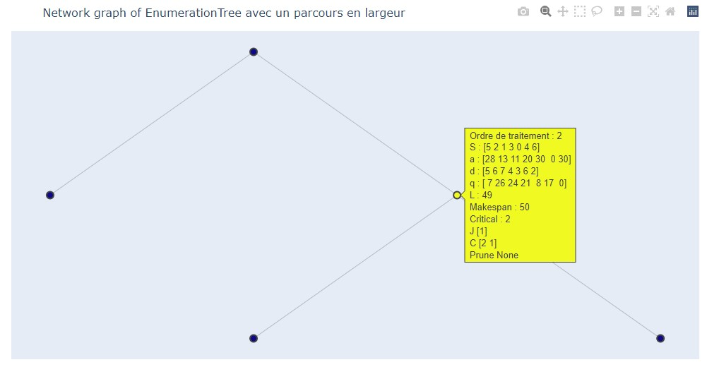
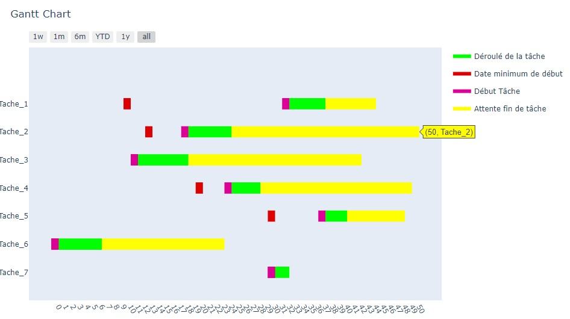

# task scheduling problem with a single machine

BY

* **CALLARD Baptiste**
* **TANNE Malo**

## PROJECT OBJECTIVE

The goal of the project is to implement a branch-and-bound algorithm for solving a task scheduling problem with a machine. 
It is possible to describe a branch-and-bound algorithm using mixed integer linear programming: MIP. 
Once the MIP is described, the solver will execute a branch-and-bound algorithm to solve it. 
We are given a method to build a branch-and-bound, this method is based on the Schrage algorithm.

The goal of this project is to realize optimized versions for MIP and branch-and-bound. Then in a second time, we compare the performances of the two methods.
For the branch & bound we also study the effect of the way to proceed nodes : `depth first search`, `breadth first search` and `best first search`.

Then we will propose an efficient and exhaustive visualization with Plotly. Each node contains its status, the current optimal value ...

We finally made a visualization of the results in the form of a Gantt chart.  

